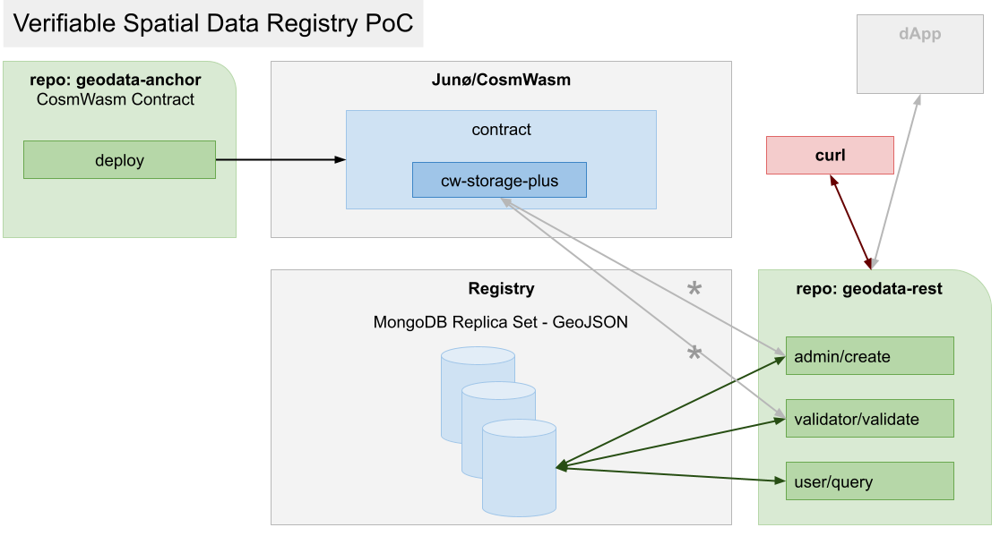

# geodata-rest

### Requirements

- [Rust](https://www.rust-lang.org/tools/install)
- [MongoDB](https://docs.mongodb.com/manual/installation/)

### Features

* Role-based jsonwebtoken authentication.
* Layered configuration system, based on [config-rs](https://github.com/mehcode/config-rs)
* Logging, based on [tracing](https://github.com/tokio-rs/tracing)
* Error handling
* [Polymorphic](https://docs.mongodb.com/manual/reference/geojson/#geometrycollection) [geospatial data and queries](https://docs.mongodb.com/manual/geospatial-queries/#geospatial-queries)  on [Mongodb Atlas](https://www.mongodb.com/atlas/database) with Replica Set support
* Data validation based on keccak-256 hashing, anchored on blockchain
* Contract messaging via [cosmrs](https://github.com/cosmos/cosmos-rust) (WIP)

### Diagram

### Dev
* IMPORTANT: $CONTRACT_ADDRESS from geodata-anchor scripts/local_deploy.sh must be applied to src/config/default.json before starting
 (see https://github.com/tsondru/geodata-anchor/README.md)
* see README-dev.md for running dev curl commands

### TODO:
* Add integration test layer with sample data (current test is an axum example)
* Complete create_msg/send_msg to contract from src/routes/geodata/create_geodata and test

### Next steps:
* Consider replacing bcrypt with argon2
* Consider [multi-hash](https://github.com/multiformats/rust-multihash)
* Move validation endpoint to externally scheduled daemon process
* Implement Docker runtimes
* Design and implement geospatial data schemas, indexes and queries, input process
* Implement external juno test blockchain for anchoring/validation
* Client app integrating above functionality

